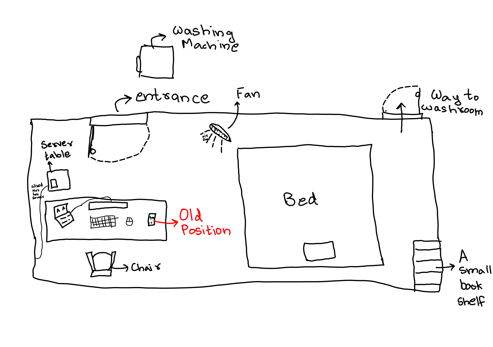
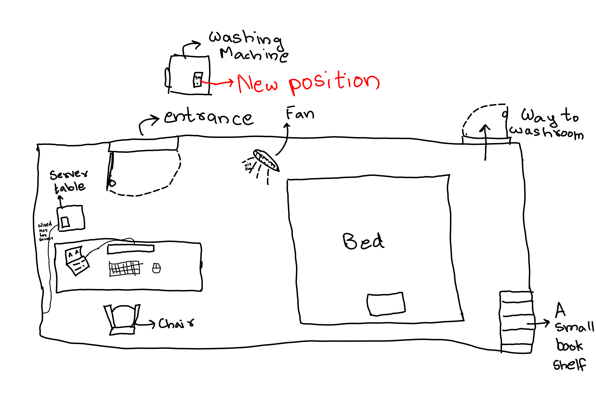
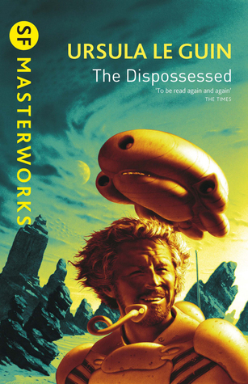
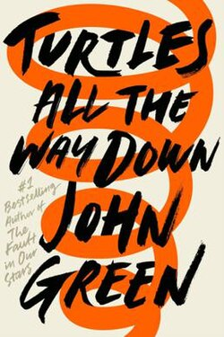

I always keep my phone near me. Bed, work, washroom, library, anywhere and everywhere. This has been my default ever since I got my first phone in college.

I remember watching a [CGP Grey video about separating out things physically in life](https://www.youtube.com/watch?v=snAhsXyO3Ck&t=1s). One of the main ideas of the video was to not use your smart phone in bed (where you sleep) or in your work place (where you have your laptop to work). I mused over the ideas from the video, but never implemented them into my life. I always had a screen timer app that prevents me from using social media apps more than five minutes at a time. So I assumed that this mental health improvement from separating things in life would never be applicable to me.

I was wrong.

After moving my phone's position. My screen unlock count has dropped 50%. I feel more happy now.

My hypothesis is that, when I keep my phone near my work station, I constantly keep taking micro decisions to check my Whats App / Instagram. These small micro decisions adds up, over the day, deteriorating my mental health.

I strongly recommend removing smart phones from places that require intentional actions.

# Reading

## Le Guin's The Dispossessed

Me and Darshan had a lot of discussions over the contents of this book. The book talks about a revolution that leads to the creation of an Anarchic society. Le Guin does not shy away from exploring the disadvantages of such a society.

## John Green's Turltes all the way down

The protagonist (Aza) of the book was quite relatable. I regularly go through some amounts of overthinking. Reading about Aza helped me, in some ways, to cope with my overthinking.

Much of my current overthinking revolves around job security, financial freedom, financial independence, life satisfaction, and finally the uncertainty of academia.

# Advent of Code

Finally solved the b part of day ten challenge. Day eleven's problems were a breeze compared to day ten. I used an Integer Linear Programming library to solve the ten b part. It feels like cheating. But YOLO.

I have decided to abandon Rust language for future competitive programming tasks. Designing the algorithm is difficult enough. I don't want to add the additional complexity that Rust syntax and memory safety adds. I might try using Rust for a future backed project. Until then C++ will remain my go to language for competitive programming.
