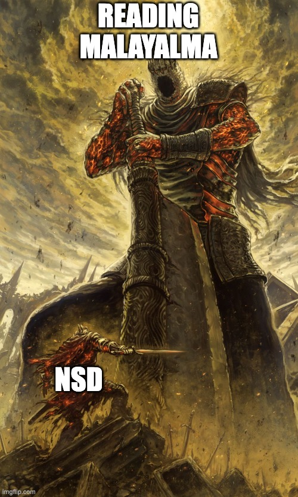
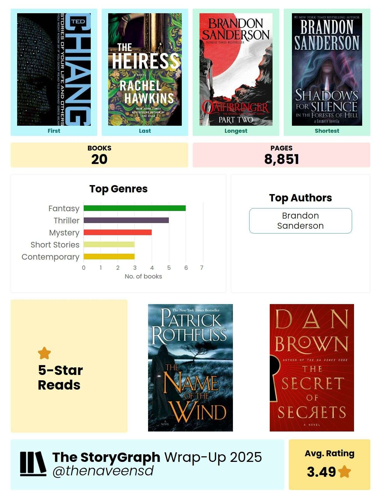
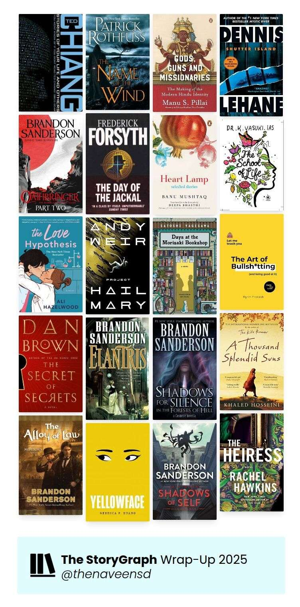

## Defeating the old boss

Malayalam has always been an elusive language for me. 

Even though it has been my primary spoken language, reading text has been a challenge. I used to stammer a lot while I read Malayalam in public, which was the only kind of reading I did in school.

I have never read Malayalam text for pleasure.

This year I wanted to make some progress in defeating this old boss.

I decided to challenge myself with a full sized Malayalam novel.

I read റാം c/o ആനന്ദി.

It was a decent book, with an emotion focused plot coupled with socially relevant topics.

## Stats from 2025 Reading

The reader me was extremely productive in 2025. I had two five star reads last year.

## Progress on other projects

1. I am trying to setup RSS feed for this blog.
2. Advent of code has become really challenging after 10A. 10B and two more days to complete the challenge.