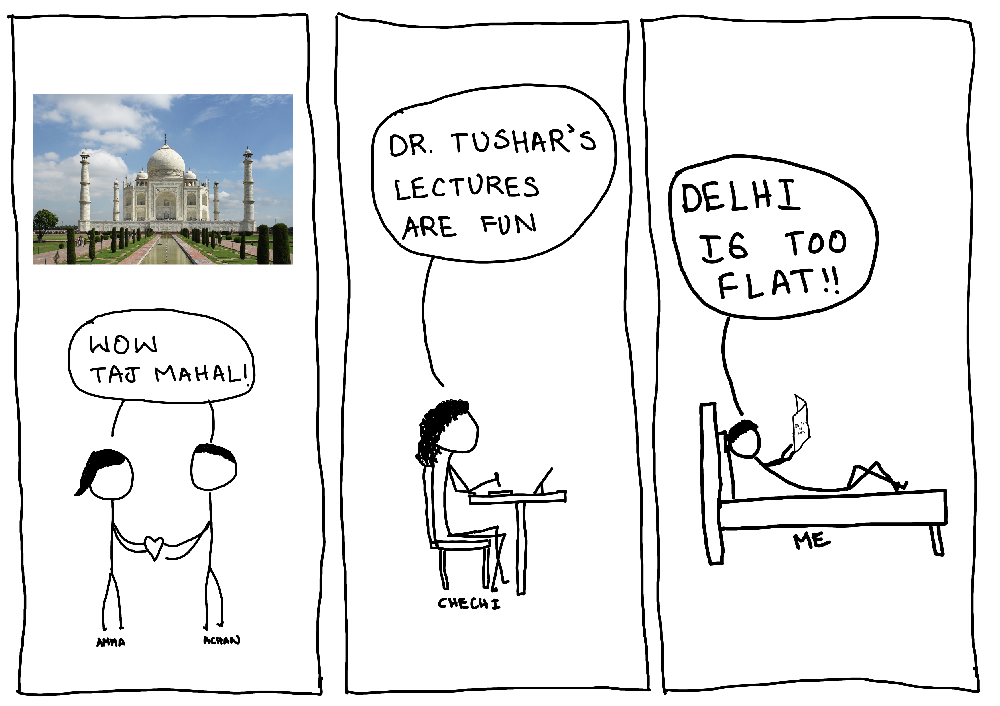
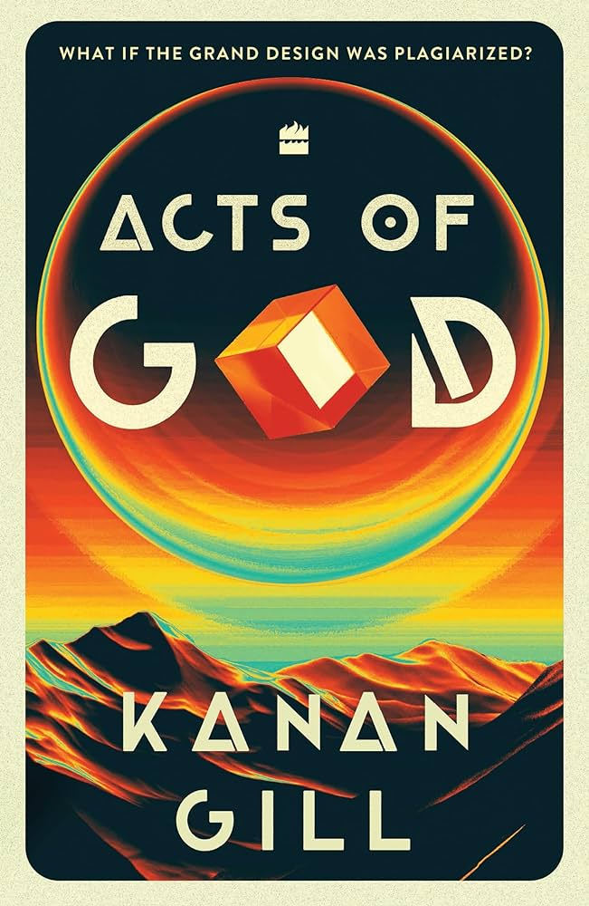
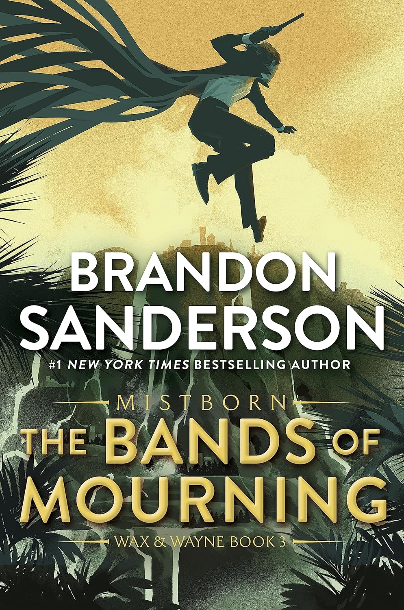
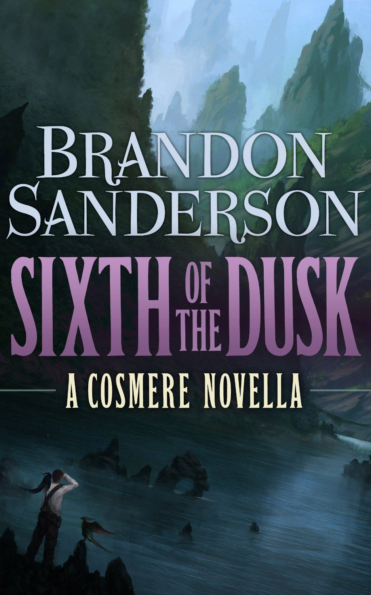
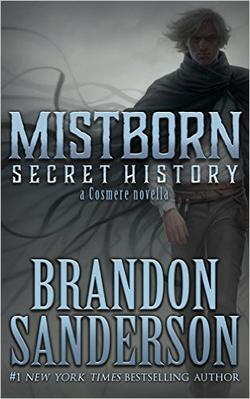
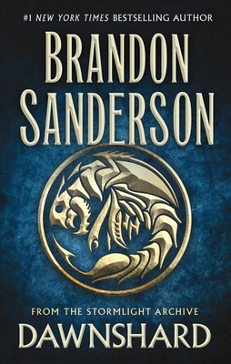
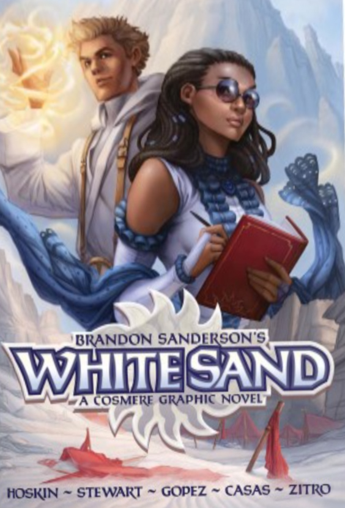

I'm a man of science.

But I have a soft corner for scientific results that go hand in hand with your intuition. (RIP *quantum computing*)

In primary school, I learned the earth to be a sphere, I never gave it a second thought.

Me, growing up around the western ghats, had to go uphill and downhill every five hundred metres from home.

The spherical earth theory made sense. World is not flat, it's very upsy downsey.

I visited Delhi last month. 

My upsy downsey mental model of the world got stress tested there. I was stunned by how flat Delhi is. 

Geographic difference between Kerala and Delhi is striking. In kerela, every car ride is a mini roller coaster. In Delhi, if you stare down a straight road, you can see the next two major junctions.

*The land is that flat*

***

# Reading

My last month's update didn't have any book update, i was lazy. I am still figuring out a system for writing consistently. 

## 1. Acts of God by Kanan Gill

Kannan gill performed his special in Trivandrum for the first time. Me and chechi went for the event, it was nice. The book, not that much. 

## 2. The Bands of Mourning by Brandon Sanderson

One more book to fill the gap to Stormlight archive book 4

## 3. Sixth of the Dusk by Brandon Sanderson

This was a fun read. I spotted a worldhopper from this book in Rhythm of War (my current read—62% in).

## 4. Mistborn: A Secret History by Brandon Sanderson

This book made me think of shards to be more closer to human characters than being an omnipotent entity in Cosmere.

## 5. Dawnshard by Brandon Sanderson

A five star read. Im a sucker for ship voyages. Darshan will know my countless rants about the unavailability of international consumer ships. 

*Aeroplanes are overrated*

## 6. White Sand 1-3 by Brandon Sanderson

I personally didn't like it. Graphic novels are not my thing. My biggest gripe was that I couldn't load it into my kindle. Colored books are a pain. Phones are too small to read them properly. Laptops are too unwieldy to be comfortable with for long sessions.

***

# Like? Share, Subscribe

You can subscribe to this blog using an rss reader. [Here is the feed link](https://naveensd.com/rss.xml)
