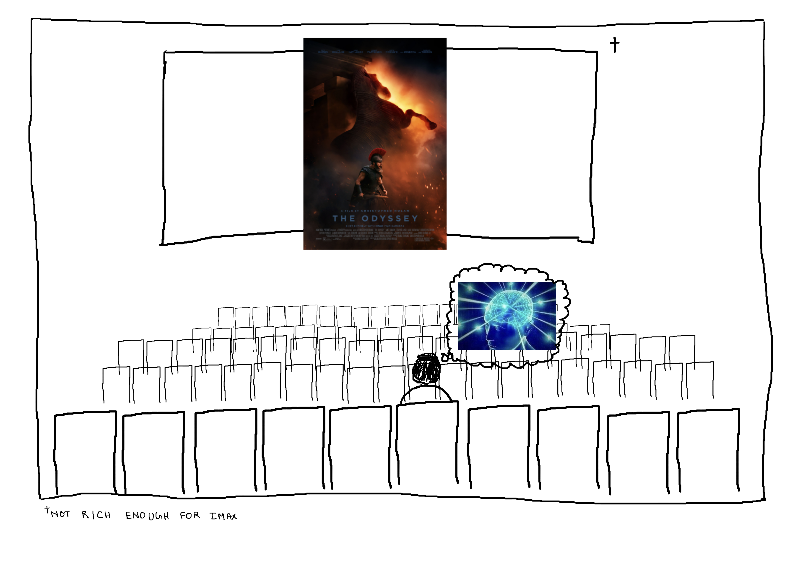
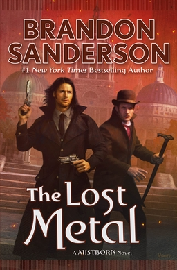

Once in a while when, I watch a movie or finish a book, my mind escapes into a brief moment of transcendence.

It happened when I finished—The Way of Kings, The Name of the Wind. And as of this month—Christopher Nolan's Odyssey.

The feeling is too *otherworldly* that my writing skills fall short of coming up with any good word combinations that could explain it to you. The best approximation I can give you is a short scene from the first Doctor Strange movie:

    

        <iframe class="video" src="https://www.youtube.com/embed/tMRIOOvEeg4?si=Dnk1oessoH9zc7bS" title="YouTube video player" frameborder="0" allow="accelerometer; autoplay; clipboard-write; encrypted-media; gyroscope; picture-in-picture; web-share" allowfullscreen></iframe>
    

Anne Hathaway's Penelope, with her strong emotions and longing for Odysseus, was the highlight of the movie—for me. In a few scenes, Penelope's emotions felt similar, to Sai Pallavi's Indhu from the movie Amaran.

The warning that Agamemnon gives Odysseus, about returning to Ithaca secretly rather than openly, resonated with me. Me planning to go to the US for my masters education might be the reason why my mind resonated with the idea. The state that I leave my friends and family will not be the same when I return from *my* odyssey.

Or I can come back to India in the [Mamooka’s aura farming style](https://youtu.be/oHsljUetCck?si=M_Sx2NEXYc8F8k25&t=8). lol.

***

# Everything else

I finished Brandon Sanderson's The Lost Metal this month. It’s a 7/10 book. Not a good score for Brandon. Brandon intended the books of arc two of Mistborn to be like *pulp fiction*. He is on-brand with that *intent*. The books are very *pulpy*. Personally, not a big fan.

***

I am 18% in on the neetcode DSA grind. I wanted to make more progress, but here we are. 

Progress on the comments system: Still working on it. Now I understand what George feels when he posts progress for his—Winds of Winter—book. 🌝.

I got distracted by the idea of using Kafka topics with a *time to live* set to infinity—why not?—as my database. I am going through a few tutorials. Hopefully next month I'll have an MVP.
